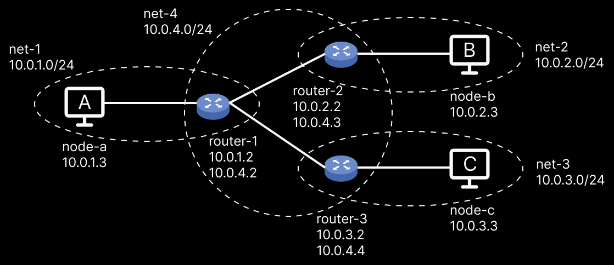

# MAC and IP Routing

A simple demonstration with clients and routers to illustrate [how IP and MAC addresses work together to route packets](https://talks.harshkapadia.me/mac-and-ip-routing/content).

This demonstration is a part of [my talk on MAC and IP Routing](https://talks.harshkapadia.me/mac-and-ip-routing).

## Network Topology



## Setup

> Some of the instructions are pertaining to a Windows base OS, but it should be easy to find similar instructions for other OSs online.

-   Install [Docker](https://docker.com) to simulate clients, routers and subnets.
    -   [More on Docker and Docker networking](https://harshkapadia2.github.io/docker)
-   Install an X Server for GUI support.
    -   NOTE: This step is optional. Please refer to the ['Working without an X Server' section](#working-without-an-x-server) if this step is not being done.
    -   Instructions: [Run GUI app in linux docker container on windows host](https://dev.to/darksmile92/run-gui-app-in-linux-docker-container-on-windows-host-4kde)
    -   Change the `DISPLAY` environment variable in all the services in [the `compose.yaml` file](compose.yaml) with the appropriate base OS' local IP address (as the article instructs).
    -   Start the X Server. (Instructions are in the article above.)
-   Navigate to the project root directory (`mac-ip-routing`).
-   Build the custom Docker image with the name `nhttpd` (Networked [HTTPd](https://httpd.apache.org)) from [the `Dockerfile`](Dockerfile).
    -   Ensure that no existing image has the name `nhttpd` using the `docker image ls` command.
        -   If an image with that name already exists, then either delete that image (`docker image rm <image_id>`) or change the image name in the command below and then in the [the `compose.yaml` file](compose.yaml) as well.
    -   Build Docker image: `docker build . -t nhttpd`
-   Create and/or start containers and subnets
    -   Ensure that no existing containers have the same names as the `container_name` field in all the `services` listed in [the `compose.yaml` file](compose.yaml) using the command `docker container ls`.
        -   If any containers have their names matching any of the names in the `compose.yaml` file, either delete the existing container (`docker container rm <container_id>`) or change the corresponding `container_name` field in the `compose.yaml` file.
    -   Ensure that no existing networks have the same names as the `name` field in all the `networks` listed in [the `compose.yaml` file](compose.yaml) using the command `docker network ls`.
        -   If any networks have their names matching any of the names in the `compose.yaml` file, either delete the existing network (`docker network rm <container_id>`) or change the corresponding `name` field in the `compose.yaml` file.
    -   Use [Docker Compose](https://docs.docker.com/compose) (bundled with the default Docker installation) to create and/or start the clients and routers, and if required, to create the networks as well: `docker compose up`
    -   If faced with Docker bugs and errors, please clear all containers (`docker container rm node-a node-b node-c router-1 router-2 router-3`) and networks (`docker network rm net-1 net-2 net-3 net-4`) before running `docker compose up` again.

## Commands

### On the Base Host Machine

> Please run these commands in the project's root directory.

-   All setup commands are listed above in the ['Setup' section](#setup).
-   [Docker commands](https://harshkapadia2.github.io/docker)

-   List all running Docker containers

    ```shell
    $ docker container ls
    ```

-   Go into Docker container and run Bash

    ```shell
    $ docker exec -it container_name bash
    ```

-   Remove all containers and networks created for this demonstration

    ```shell
    $ sh clean-up.sh
    ```

### In the Containers

-   Packet capture

    > NOTE:
    >
    > -   Please run this command on all containers.
    > -   [More on `tcpdump`](https://wizardzines.com/zines/tcpdump)

    ```shell
    $ tcpdump -envA -i any -w htdocs/file_name.pcap
    ```

-   Packet analysis

    > NOTE:
    >
    > -   Please start the X Server before running this command for GUI support. Instructions are above in the ['Setup' section](#setup).
    > -   If this doesn't work, forget about the X Server and just use Wireshark on the base host machine. Please refer to the ['Working without an X Server' section](#working-without-an-x-server) below.
    > -   [More on Wireshark](https://wireshark.org)

    ```shell
    $ wireshark htdocs/file_name.pcap
    ```

-   List ARP cache

    ```shell
    $ arp -n
    ```

-   Clear ARP cache

    ```shell
    $ ip -s -s neigh flush all
    ```

    <sub><a href="https://linux-audit.com/how-to-clear-the-arp-cache-on-linux" target="_blank" rel="noreferrer">source</a></sub>

-   List IP table

    ```shell
    $ ip route show table all
    ```

## Working without an X Server

-   Packet capture is done using `tcpdump` and its results are stored in `file_name.pcap` packet capture files in the `/usr/local/apache2/htdocs` directory if the commands in [the 'In the Containers' section](#in-the-containers) are followed.
-   Wireshark is used to open those packet capture (`.pcap`) files to analyse them.
-   The X Server is installed so that Docker can have GUI support to open Wireshark's GUI.
-   Now if the X Server is not installed on the base host machine or is not working, then
    -   Install Wireshark on the base host machine.
    -   Open the packet capture files from each of the node or router directories in this project (Eg: [`./node-a`](node-a), etc.) in Wireshark
        -   This is possible as these directories are mapped to the `/usr/local/apache2/htdocs` directory of each container.
